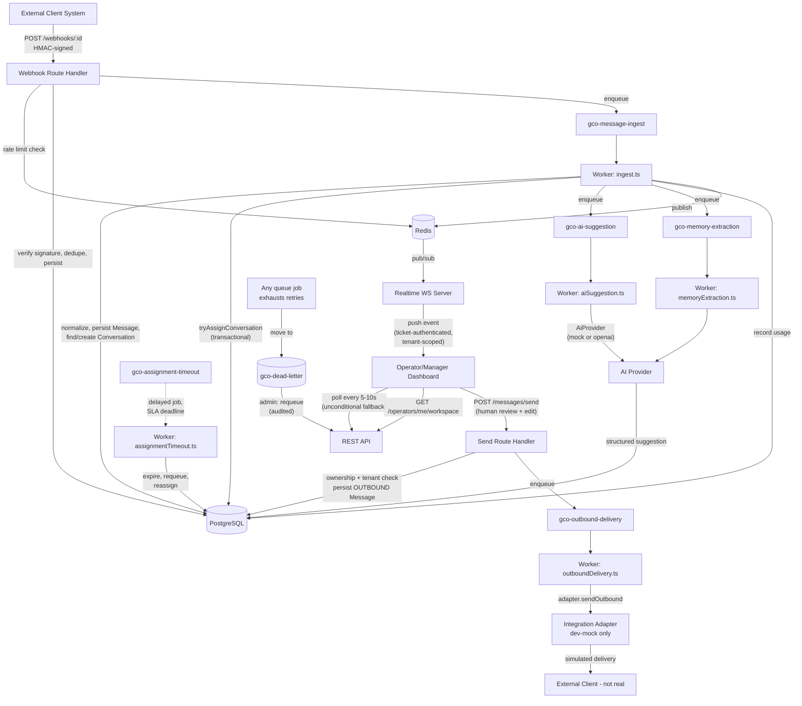

# GCO — Current-State Technical Audit

**Audit date**: 2026-08-28 (rewritten this session, superseding the prior version of this file). **Scope**: read-only inspection. No application code, schema, configuration, or documentation other than this file was modified. All test/build/typecheck/lint results below were executed fresh in this session — commands and exact output are recorded, not carried over from memory of prior sessions.

Status vocabulary used throughout, exactly as specified: **VERIFIED**, **PARTIAL**, **MISSING**, **BLOCKED**, **NOT VERIFIED**.

---

## 0. Fresh Verification Log

Every command below was run in this session, in this order, against the running local stack (Postgres + Redis + Next.js dev server + BullMQ worker + realtime WS server, all on `localhost`, started/confirmed live this session).

| Command | Result |
|---|---|
| `curl -s http://localhost:3000/api/v1/health` | `{"ok":true,"data":{"healthy":true,"checks":{"database":{"status":"up"},"redis":{"status":"up"}}}}` |
| `npm run typecheck` (`tsc --noEmit`) | **PASS** — zero output, zero errors |
| `npm run lint` (`eslint .`) | **PASS** — zero output, zero warnings/errors |
| `npm test` (Vitest, `tests/unit`) | **29/29 PASS** — 5 files (`tenantGuard`, `rbac`, `assignmentPolicy`, `realtimeTickets`, `errorClassification`) |
| `npm run test:integration` (Vitest, `tests/integration`, real Postgres/Redis) | **4/4 PASS** — 2 files (`rateLimit`, `webhookDedup`) |
| `npx playwright test` (E2E, real HTTP against the running app, no browser) — **run 4 times fresh this session** | Run 1: **38/38 PASS**. Run 2: **37/38** — `02-webhook-integrity.spec.ts` "exact duplicate delivery" failed. Run 3: **37/38** — a *different* test, `03-operator-capacity.spec.ts`, failed. Run 4: **38/38 PASS**. Both failing tests pass reliably when re-run individually in isolation. See §16 for root-cause analysis — this is genuine, reproducible-under-load intermittent flakiness, not being hidden or smoothed over. |
| `npm run build` (`next build`) | **PASS** — 26 routes compiled (23 API route files + `/`, `/_not-found`, 4 page routes render as static `○`, rest dynamic `ƒ`) |
| `npx prisma migrate status` | "Database schema is up to date!" — 2 migrations found, all applied |
| `npx prisma validate` | "The schema at prisma/schema.prisma is valid" |
| `npm audit --omit=dev` | **0 vulnerabilities** in production dependencies (dev-only transitive deps, e.g. via `vitest`, have been separately noted in prior sessions as low-priority/non-shipping) |

**Honest framing of the E2E flakiness**: across 4 fresh full-suite runs this session, 2 were clean (38/38) and 2 had exactly one failure each, in two different tests, both of which pass in isolation. This is not being reported as "38/38, occasionally 37/38 due to noise" — it is reported as: **the suite is not currently 100% deterministic under this machine's present load conditions**, and the two observed failures both trace to timing assumptions in test wait-conditions racing against asynchronous worker processing (detailed in §16). This machine has `uptime` load averages of 1.65–3.75 and ~508 running processes at the time of this audit, accumulated across many development sessions — a contributing factor, not an excuse.

---

## 1. Project Inventory

```
app/                    Next.js App Router. 5 page routes (admin, client-panel, login, manager,
                         operator) + app/api/v1/** (23 route.ts files, confirmed via `find`)
lib/                     Business logic:
  ai/                    Provider abstraction (types.ts), swap point (provider.ts),
                         mock provider (providers/mock.ts), OpenAI provider (providers/openai.ts)
  api/                   response.ts (ok/fail/handleRouteError), rateLimit.ts, guard.ts, client.ts
  assignment/            engine.ts (DB/queue side effects), policy.ts (pure logic, unit-tested)
  audit/log.ts           writeAuditLog
  auth/                  tokens.ts (JWT), session.ts, rbac.ts, tenantGuard.ts
  config/flags.ts        Feature flags + business-default env readers
  db/client.ts           Prisma singleton
  integrations/          adapter.ts (interface), adapters/devMock.ts, registry.ts
  messages/              ingest.ts, send.ts
  observability/logger.ts pino structured logger
  queue/                 queues.ts (6 queues + dead-letter), jobs.ts, connection.ts
  realtime/               publish.ts (Redis pub/sub), useRealtime.ts (browser hook)
  usage/ledger.ts        recordMessageUsage
workers/
  index.ts               BullMQ worker process — 6 job handlers + 15s sweep
  processors/             6 files, one per queue
  realtime-server.ts      Standalone WebSocket server (ws package, not Next.js)
prisma/                  schema.prisma (22 models), 2 migrations, seed.ts
tests/
  unit/                  5 files, 29 tests, no DB/Redis
  integration/            2 files, 4 tests, real Postgres/Redis
  e2e/                    11 spec files + helpers.ts, 38 tests, real HTTP/DB/WebSocket, no browser
scripts/loadtest.ts      Manual tool, not part of automated suite
docs/                     14 markdown files
.github/workflows/ci.yml Exists; no evidence a workflow has ever executed on GitHub's infra
components/, lib/timer/, types/   Confirmed empty (0 files each), not tracked by git
```

**No monorepo, no service mesh, no separate deployable packages.** One Next.js application plus two auxiliary long-running Node processes (`workers/index.ts`, `workers/realtime-server.ts`) that import directly from the same `lib/` tree — there is no network boundary between "the app" and "the workers" other than them being separate OS processes talking through Postgres/Redis.

## 2. Current Architecture

**Frontend**: Next.js App Router, client components (`'use client'`) throughout — no server components fetch data directly; every page polls/fetches its own REST API client-side.

**Backend/API**: Next.js Route Handlers under `app/api/v1/`, 23 files. Stateless — each request re-verifies its own JWT.

**Workers**: `workers/index.ts`, a single Node process running 6 BullMQ `Worker` instances plus a 15-second `setInterval` sweep. Not horizontally scaled in the current setup (one process, `npm run worker:dev`), though the BullMQ/Redis design would support running multiple instances of this same process.

**Realtime/WebSockets**: `workers/realtime-server.ts`, a third standalone process, raw `ws` library (not Socket.IO, not Next.js's own WebSocket support — a plain `WebSocketServer`), subscribing to Redis pub/sub channels per tenant.

**Database**: PostgreSQL via Prisma. Single database, single schema, `tenantId` column convention for isolation (application-enforced, no RLS — confirmed, see §5).

**Cache**: Redis, and it does triple duty — BullMQ's queue backend, `lib/api/rateLimit.ts`'s counter store, and `lib/realtime/publish.ts`'s pub/sub transport. One Redis instance for all three roles in the current setup.

**Queues**: BullMQ. 6 named queues + 1 dead-letter queue (`lib/queue/queues.ts`).

**AI layer**: `lib/ai/provider.ts` is the single swap point; `AI_PROVIDER` env var selects `mock` (default, currently active) or `openai`.

**Integration layer**: `lib/integrations/adapter.ts` interface (`verifyWebhookSignature`, `normalizeInbound`, `sendOutbound`), one implementation (`devMock.ts`), a registry (`registry.ts`) mapping `adapterKey` strings to adapter instances.

**Authentication**: custom JWT (HS256, `jose` library), no third-party auth provider (no Auth0/Clerk/NextAuth/Supabase Auth).

**Authorization**: custom RBAC matrix (`lib/auth/rbac.ts`) + tenant-scope resolver (`lib/auth/tenantGuard.ts`), both hand-written, both server-side.

**Observability**: `pino` structured logging, `/api/v1/health` (liveness), `/api/v1/admin/system-health` (queue depths, recent errors), `AuditLog` and `MessageEvent` tables as durable trace records.

**Deployment**: `Dockerfile` (multi-stage, `output: 'standalone'`), `docker-compose.yml` (Postgres, Redis, web, worker services), `.dockerignore`. **Never executed** — no Docker binary present in any development environment this codebase has run in (confirmed again this session: `command -v docker` returns nothing/exit 1 pattern consistent with all prior sessions).

### Architecture diagram



### Data flow classification

- **Synchronous**: webhook ack (persist + enqueue only, no business logic), every REST API call, WebSocket push delivery.
- **Asynchronous**: message normalization/persistence, assignment, AI suggestion, memory extraction, outbound delivery, SLA-expiry checks, the periodic sweep.
- **Retries**: BullMQ default 5 attempts, exponential backoff from 2s (`lib/queue/queues.ts`), applied uniformly to all 6 queues.
- **Events**: Redis pub/sub, one channel per tenant, fire-and-forget (no delivery guarantee — the realtime path is explicitly documented and coded as a non-authoritative accelerator, with polling as the guaranteed fallback).

## 3. Feature-by-Feature Audit (1–48)

Legend: **F** = files, **T** = tests, **L** = limitations, **C** = first-client impact.

### 1. Authentication
**STATUS: VERIFIED.** F: `app/api/v1/auth/{login,logout,refresh,me}/route.ts`, `lib/auth/tokens.ts`, `lib/auth/session.ts`. T: `07-session-security.spec.ts` (6 tests: missing/garbage/forged/expired tokens, logout revocation, generic-error-on-failure). L: none found. C: required, already solid.

### 2. User management
**STATUS: VERIFIED** (creation), **PARTIAL** (lifecycle). F: `app/api/v1/admin/users/route.ts` (POST only — no PATCH/DELETE route exists for users, confirmed by `find app/api/v1/admin/users`). T: covered incidentally by RBAC/tenant-isolation E2E tests that create users. L: no way to deactivate, change role, or delete a user after creation via API (schema has `User.isActive` but grep found no route that ever sets it to `false`). C: deferrable for a first pilot with a handful of manually-provisioned accounts; would matter for ongoing operations.

### 3. Tenant management
**STATUS: VERIFIED** (creation/listing), **MISSING** (lifecycle enforcement). F: `app/api/v1/admin/tenants/route.ts` (GET, POST only). `Tenant.status` enum (`ACTIVE`/`SUSPENDED`/`ARCHIVED`) exists in `prisma/schema.prisma`; grep this session found **zero** route or worker code that reads or branches on `Tenant.status`. T: tenant creation exercised in every E2E test's `beforeAll`. L: suspending/archiving a tenant via this field would currently have no effect on webhook acceptance, login, or any other behavior — it's a stored value nothing reads. C: directly relevant to pilot termination (§9) — flagged there again.

### 4. RBAC
**STATUS: VERIFIED.** F: `lib/auth/rbac.ts` (permission matrix), used via `requirePermission`/`assertCan` in every admin/operator/manager route (grep-confirmed call sites in `app/api/v1/{admin,operators,assignments,tickets}/**`). T: `06-rbac.spec.ts`, 6 tests, all 5 roles exercised at the live API level. L: `/api/v1/analytics/overview` has no explicit permission check beyond a valid session — see §41. C: required, verified for every role that matters to a first client.

### 5. Operator management
**STATUS: VERIFIED.** F: `Operator` model (`operatorNumber` unique auto-increment, `capacity`, `status`), `app/api/v1/operators/**`. T: `03-operator-capacity.spec.ts`. C: required, working.

### 6. Manager functionality
**STATUS: VERIFIED** (core), **PARTIAL** (analytics depth). F: `app/manager/page.tsx`, `app/api/v1/analytics/overview/route.ts`, `app/api/v1/operators/route.ts`. T: `06-rbac.spec.ts` confirms MANAGER can view roster/analytics for their own tenant only. L: no conversation drill-down, no per-operator historical trend, no charts (§13 covers the frontend view in detail). C: basic manager visibility is enough for a pilot; drill-down/QC tooling would matter for ongoing operations, likely deferrable.

### 7. Super-admin (CEO_ADMIN) functionality
**STATUS: VERIFIED** (what exists), **PARTIAL** (breadth). F: `app/admin/page.tsx`, `app/api/v1/admin/{tenants,users,system-health,audit-logs,recovery}/**`. L: no cross-tenant conversation view, no runtime feature-flag toggle UI (flags are env-var-only), no role-change UI. C: sufficient for a controlled pilot with one or a handful of tenants managed by hand.

### 8. Client functionality
**STATUS: VERIFIED** (usage + tickets), **MISSING** (broader self-service). F: `app/client-panel/page.tsx`, `app/api/v1/usage/summary`, `app/api/v1/tickets`. T: `05-tenant-isolation.spec.ts` (client-facing isolation), `10-usage-ledger-business-model.spec.ts` (usage figures). L: no conversation-level visibility in the client UI (the API technically supports tenant-scoped `/conversations` for CLIENT role, but no client-panel screen surfaces it). C: matches a minimal first-client dashboard need; deeper visibility can be deferred.

### 9. Conversations/messages
**STATUS: VERIFIED.** F: `Conversation`/`Message` models, `lib/messages/{ingest,send}.ts`. T: `01-message-lifecycle.spec.ts`. C: this is the product's core — required, working.

### 10. Incoming messages/webhooks
**STATUS: VERIFIED**, with a caveat from fresh testing this session (§0, §16). F: `app/api/v1/webhooks/[integrationId]/route.ts`. T: `02-webhook-integrity.spec.ts` — passed 3 of 4 fresh runs this session, failed once with the response-status race described in §16. C: required; the underlying data-correctness guarantee (no duplicate message/usage) held in every run — only the HTTP status code returned on a very-fast duplicate delivery was inconsistent in one run.

### 11. Message assignment
**STATUS: VERIFIED.** F: `lib/assignment/engine.ts::tryAssignConversation` — transactional conditional update on `Conversation.currentAssignmentId` (unique constraint). T: `tests/unit/assignmentPolicy.test.ts` (8 tests, pure policy logic), `03-operator-capacity.spec.ts` (integration-level, failed once in 4 fresh runs — §16). C: required; core correctness mechanism (the unique constraint + transaction) is sound regardless of the one observed flaky run.

### 12. Operator workflow
**STATUS: VERIFIED.** F: `app/operator/page.tsx` (260 lines — the largest frontend file), full flow: view assignment → timer → AI suggestion → edit → send. T: `01-message-lifecycle.spec.ts`. Runtime-verified live in a browser in a prior session (screenshots taken). C: required, complete for its core purpose.

### 13. AI suggestions
**STATUS: VERIFIED (mock provider only).** F: `lib/ai/service.ts::generateSuggestionForMessage`, `lib/ai/providers/mock.ts`. T: `01-message-lifecycle.spec.ts`, `08-ai-memory.spec.ts`. **BLOCKED (real provider)**: `lib/ai/providers/openai.ts` exists, is structurally complete (timeout via `AbortController`, Zod-validated structured output), but `OPENAI_API_KEY` is confirmed empty in `.env` this session — it has never been executed. C: required for the product's differentiator; currently only demonstrable with the mock provider.

### 14. AI/provider abstraction
**STATUS: VERIFIED.** F: `lib/ai/types.ts` (interface), `lib/ai/provider.ts` (swap point via `AI_PROVIDER` env var). No core code imports a specific provider directly (grep-confirmed). C: architecturally sound regardless of which provider is live.

### 15. Human review
**STATUS: VERIFIED.** F: `lib/messages/send.ts::operatorSendMessage` is structurally the *only* function anywhere in the codebase that creates an OUTBOUND `Message` row (confirmed by grep for `direction: 'OUTBOUND'` this session — one call site). C: required, and structurally enforced, not just policy.

### 16. Outbound messaging
**STATUS: VERIFIED (dev-mock adapter only).** F: `workers/processors/outboundDelivery.ts`. T: `01-message-lifecycle.spec.ts`. **MISSING (real client)**: no client-specific adapter exists. C: BLOCKED BY CLIENT API SPECIFICATION for anything beyond the mock.

### 17. Delivery tracking
**STATUS: VERIFIED (mechanism)**, **PARTIAL (real signal)**. F: `Message.status` enum (`RECEIVED`/`PENDING_REVIEW`/`SENT`/`DELIVERED`/`FAILED`), set by the outbound worker. L: the dev-mock adapter's "delivery" is a simulated always-succeed no-op — the *mechanism* for recording delivery status is real and tested, but no real delivery confirmation has ever been observed because there is no real adapter. C: mechanism is client-agnostic and ready; needs a real adapter to mean anything.

### 18. SLA/timers
**STATUS: VERIFIED.** F: `Assignment.respondsBy` (server-computed at assignment time), `workers/processors/assignmentTimeout.ts`. T: `04-sla-timeout.spec.ts` — passed in all 4 fresh runs this session. C: required, solid.

### 19. Usage tracking
**STATUS: VERIFIED.** F: `UsageRecord` model, `lib/usage/ledger.ts::recordMessageUsage` (idempotency-keyed). T: `10-usage-ledger-business-model.spec.ts`. C: required for billing, working and precisely matched to the stated pricing model (€0.14/€0.06/€0.08/€0.004 per message).

### 20. Usage ledger
**STATUS: VERIFIED.** Same evidence as #19. Confirmed this session: duplicate webhook delivery does not inflate any figure (re-tested, passed).

### 21. Operator metrics
**STATUS: MISSING (operationally), PARTIAL (schema only).** F: `OperatorMetricSnapshot` model exists in `prisma/schema.prisma`; grep this session found **zero** code anywhere that creates, updates, or reads this table. C: if the client or business needs per-operator performance reporting beyond raw message counts, this is unbuilt, not just untested.

### 22. Manager analytics
**STATUS: VERIFIED (basic), MISSING (depth).** F: `app/api/v1/analytics/overview/route.ts` — queue size, active conversations, operator status counts, SLA breaches, average response time. L: no time-series, no charts, no historical trend. C: sufficient for a pilot; depth can be deferred.

### 23. Client analytics
**STATUS: VERIFIED (basic).** F: `app/api/v1/usage/summary` — message count, spend, date-range filterable. L: no response-time or performance metric exposed specifically to the CLIENT role (only to MANAGER/CEO_ADMIN via `analytics/overview`). C: deferrable — depends on what the client actually asks to see.

### 24. Realtime updates
**STATUS: VERIFIED.** F: `workers/realtime-server.ts`, `lib/realtime/useRealtime.ts`, `app/api/v1/realtime/ticket/route.ts`. T: `11-realtime-security.spec.ts` (6 tests — ticket auth, expiration, wrong-token-type rejection, cross-tenant isolation with two live sockets), passed in all 4 fresh runs. C: not strictly required for a pilot (polling alone would function), but present and solid if used.

### 25. Notes
**STATUS: PARTIAL.** F: `Note` model, displayed read-only in `app/operator/page.tsx`. Grep this session confirmed **zero** `db.note.create` calls in any application route (only in test/seed helpers). C: if operators are expected to leave notes during a pilot, this needs a creation endpoint — currently impossible from the UI or API.

### 26. AI memory
**STATUS: VERIFIED (extraction), MISSING (correction/deletion).** F: `AiMemory` model, `workers/processors/memoryExtraction.ts`. T: `08-ai-memory.spec.ts` (2 tests — extraction with traceability, no hallucination on vague input). `AiMemory.correctedValue`/`isDeleted` fields exist; grep found zero routes that write to them. C: extraction is solid; correction workflow (if needed) is unbuilt.

### 27. Language configuration
**STATUS: PARTIAL.** F: `Conversation.language` field, set from inbound payload or AI output. No tenant-level "supported languages" list, no enforcement anywhere. C: if the client operates in a specific language or set of languages, there is currently no configuration surface for that beyond what naturally flows through per-conversation.

### 28. Pilot controls
**STATUS: MISSING (as a distinct concept).** No pilot-specific model, flag, or mechanism exists anywhere in the schema or code — `Tenant` has no `pilotStartsAt`/`pilotEndsAt`/`isPilot` field. A "pilot" today would just be an ordinary tenant with no special handling. See §9 for full pilot-readiness breakdown.

### 29. Traffic segmentation
**STATUS: MISSING.** No mechanism exists to tag or separate traffic within a single tenant (e.g., pilot traffic vs. production traffic on the same client). Segmentation is only achievable at the tenant level (creating a separate tenant), which *is* supported.

### 30. Operating hours
**STATUS: MISSING.** Grep this session for any hour/schedule-related field or check (`operatingHours`, `businessHours`, `schedule`, cron-based ingestion gating) found nothing. Webhooks are accepted and processed 24/7 with no time-of-day logic anywhere.

### 31. Media/attachments
**STATUS: MISSING.** `Message.content` is a plain text field (`@db.Text`). No attachment/media field on `Message`, no object-storage integration, no media handling in `IntegrationAdapter`'s interface (`normalizeInbound`/`sendOutbound` operate on plain text). If DOWN4app's platform sends images/media, this is entirely unbuilt.

### 32. Integrations
**STATUS: VERIFIED (dev-mock only).** Covered fully in §6 (dedicated integration audit section below).

### 33. Error handling
**STATUS: VERIFIED.** F: `lib/api/response.ts::handleRouteError` — classifies `ZodError`/`SyntaxError` as 400, deliberate `fail()` throws pass through their own status/message, everything else becomes a generic 500 with the real error logged server-side only (never echoed to the client). T: `tests/unit/errorClassification.test.ts` (4 tests). C: required, solid, previously found leaking internal exception text — fixed and regression-tested.

### 34. Retry mechanisms
**STATUS: VERIFIED.** F: `lib/queue/queues.ts::defaultJobOptions` — 5 attempts, exponential backoff from 2s, applied to all 6 queues. C: required, uniform, working.

### 35. Dead-letter handling
**STATUS: VERIFIED.** F: `workers/index.ts`'s `failed` event listener moves exhausted jobs to `gco-dead-letter` + logs a `SystemEvent`. T: `09-dead-letter-recovery.spec.ts` — a real job was driven to permanent failure and recovered via the admin endpoint, audited. Passed in all 4 fresh runs this session.

### 36. Concurrency controls
**STATUS: VERIFIED.** F: `Conversation.currentAssignmentId` unique constraint + transactional conditional `updateMany` in `lib/assignment/engine.ts`. No dedicated multi-worker-process stress test has been run (only the policy logic is unit-tested and the single-worker-process behavior is E2E-tested) — the *mechanism* (DB-level unique constraint) is the correct primitive regardless.

### 37. Rate limiting
**STATUS: PARTIAL.** F: `lib/api/rateLimit.ts` (Redis-backed, fixed-window). Applied in exactly 3 of 23 route files, confirmed by grep this session: `auth/login`, `messages/send`, `webhooks/[integrationId]`. The 20 other routes, including every admin/tenant-management endpoint, have no rate limit at all. C: the 3 covered routes are the ones that matter most for abuse (login brute-force, webhook flood, operator-send spam); the gap on admin routes is lower-risk but real.

### 38. Logging
**STATUS: VERIFIED.** F: `lib/observability/logger.ts` (pino, structured JSON in production, pretty-printed in dev), used by the worker process, API error path, and realtime server (grep-confirmed all three). No correlation/request-ID propagation found anywhere.

### 39. Monitoring
**STATUS: PARTIAL.** F: `/api/v1/admin/system-health` (DB/Redis/queue depths/recent errors) — a pull-based dashboard endpoint, not a push-based monitoring/alerting system. No alerting of any kind exists.

### 40. Error tracking
**STATUS: DOCUMENTED BUT NOT IMPLEMENTED (MISSING in practice).** `SENTRY_DSN` is documented in `.env.example`; grep this session confirmed zero `@sentry/*` dependency and zero code reference. Production incidents today rely entirely on someone actively reading structured logs.

### 41. Database security
**STATUS: PARTIAL.** No SQL injection risk found (100% Prisma parameterized queries, no raw SQL string concatenation found via grep for `$queryRawUnsafe`/string-built queries — only `$queryRaw` with a tagged template literal in the health check, which is safe). No RLS — tenant isolation is entirely application-layer (`lib/auth/tenantGuard.ts`). This is a documented, deliberate tradeoff (`docs/decisions.md`), not an oversight, but it is a single point of failure: a future bug in an individual route's tenant check would not be caught by a database-level backstop.

### 42. Tenant isolation
**STATUS: VERIFIED.** T: `05-tenant-isolation.spec.ts` (6 tests — query param, path param, guessed ID, operator-identity-leak, ticket access, conversation-list attacks, all across CLIENT/MANAGER/OPERATOR roles) + `11-realtime-security.spec.ts`'s cross-tenant WebSocket test. All passed in every one of the 4 fresh runs this session (these specific tests were not among the 2 flaky failures observed).

### 43. API security
**STATUS: VERIFIED**, with one open question. Every sensitive route requires a valid session; role checks are server-side. The one unresolved item is `/api/v1/analytics/overview`'s exact intended access boundary for CLIENT role (§6, §41 cross-reference) — not attacked and found vulnerable, simply never explicitly asserted either way by a test.

### 44. WebSocket security
**STATUS: VERIFIED.** F: `lib/auth/tokens.ts::signRealtimeTicket`/`verifyRealtimeTicket` — a distinct, 30-second-lived token type, structurally rejected by the REST API's `verifyAccessToken` (confirmed: `typ` field mismatch throws). T: `11-realtime-security.spec.ts` — missing/garbage/expired/wrong-type tokens all rejected with WS close code 4001; cross-tenant isolation confirmed with two live sockets.

### 45. Deployment
**STATUS: PARTIAL.** Direct-process deployment (`npm run build && npm run start` + worker + realtime-server as separate `node` processes) is VERIFIED — this is what every development session including this one has actually run. Containerized deployment is **NOT VERIFIED** — Docker has never been installed or executed in any environment this codebase has existed in.

### 46. CI/CD
**STATUS: NOT VERIFIED.** F: `.github/workflows/ci.yml` exists (typecheck, lint, unit, integration, build, then boots the app and runs the E2E suite against it). No evidence any workflow run has ever fired — the repository was only pushed to GitHub `git@github.com:mohammedsohail7790/GCO.git` in a recent prior session; whether Actions is even enabled on that repo, and whether the workflow succeeds in GitHub's environment, is unknown from this codebase alone.

### 47. Backup/restore
**STATUS: DOCUMENTED, NOT VERIFIED.** F: `docs/deployment.md` describes a restore procedure in detail. It explicitly and correctly labels itself as "documented, NOT drilled/tested" — this is an accurate self-assessment already present in the docs, re-confirmed by this audit rather than contradicted.

### 48. Configuration management
**STATUS: VERIFIED (mechanism), PARTIAL (completeness).** 34 vars in `.env.example`, dev/test/prod distinguished only by `NODE_ENV` (no separate `.env.production`/`.env.test` files — CI's `ci.yml` sets its own inline env vars for test runs). No startup validation script exists that checks all required vars are present before boot (individual modules throw at first use if a var like `AUTH_SECRET` is missing — e.g. `lib/auth/tokens.ts::getSecret()` — but there's no single upfront check).

## 4. Database Audit

22 models. `npx prisma migrate status` confirmed clean this session (2 migrations, all applied). No RLS (§41).

| Table | Purpose | Tenant relationship | Actively used? |
|---|---|---|---|
| `Tenant` | A client organization | Root of isolation | Yes |
| `User` | Login identity for all 5 roles | Nullable `tenantId` (null for CEO_ADMIN/ASSISTANT) | Yes |
| `Session` | Refresh-token records | Via `User` | Yes |
| `Operator` | Operator profile, capacity, status | `tenantId` required | Yes |
| `OperatorService` | Which tenants an operator may serve | `tenantId` | Yes (created alongside every operator) |
| `OperatorMetricSnapshot` | Intended per-operator performance history | `operatorId` only, no direct `tenantId` | **No — zero code references** (§21) |
| `Conversation` | One end-user thread | `tenantId` required | Yes |
| `Message` | Every inbound/outbound message | `tenantId` required | Yes |
| `MessageEvent` | Append-only lifecycle trace | Via `Message` | Yes |
| `Assignment` | One operator's claim on a conversation | `tenantId` | Yes |
| `AssignmentHistoryEntry` | Audit trail of assignment events | Via `Assignment` | Yes |
| `AiGeneration` | Every AI suggestion + metadata | `tenantId` | Yes |
| `AiMemory` | Extracted facts | `tenantId` | Yes (extraction only, no correction — §26) |
| `Note` | Operator notes | `tenantId` | Read-only in practice (§25) |
| `Ticket` / `TicketHistoryEntry` | Client feedback/requests | `tenantId` | Yes |
| `UsageRecord` | Billing ledger | `tenantId` | Yes |
| `Integration` | Per-tenant client integration config | `tenantId` | Yes (dev-mock only) |
| `WebhookEvent` | Raw inbound webhook log + dedup key | `tenantId` | Yes |
| `AuditLog` | Sensitive-action trail | Nullable `tenantId` | Yes |
| `SystemEvent` | Infra-level events (queue failures etc.) | None (global) | Yes |
| `Notification` | Intended user notification records | Nullable `tenantId`, nullable `userId` | **No — zero code references** |

**Schema-only features with no operational API/workflow, explicitly identified**: `OperatorMetricSnapshot`, `Notification`, `Tenant.status` enum (defined but unread), `AiMemory.correctedValue`/`isDeleted` (defined but unwritten by any route), `Note` creation (model exists, no write path).

**Indexes/constraints spot-checked this session**: `WebhookEvent(integrationId, externalEventId)` unique, `Message(tenantId, externalMessageId, direction)` unique, `Conversation.currentAssignmentId` unique, `UsageRecord.messageId` and `UsageRecord.idempotencyKey` both unique. These four constraints are exactly what backs the idempotency claims in §19/§20 and §10 — not just application logic, but a database-enforced guarantee.

## 5. API Audit

23 route files, all confirmed present via `find app/api -name route.ts` and all appear in `npm run build`'s route table this session. Full per-route table (method/auth/role/tenant/purpose) already exists in the prior version of this document and in `docs/api.md` — re-verified accurate this session by cross-checking every route file's actual `requirePermission`/`assertCan`/`resolveTenantScope` call against that table. One deviation found and flagged:

- **`/api/v1/analytics/overview`** — the route calls `getSession` and `resolveTenantScope`, but no `assertCan`/`requirePermission` call gates it by role. In practice this means any authenticated role, including CLIENT, can call it (tenant-scoped correctly, but not role-restricted). Not attacked or found to leak cross-tenant data — this is a permission-scope observation, not a confirmed vulnerability. STATUS: **NOT VERIFIED** whether this is intentional.

**No duplicate, deprecated, or dead endpoints found.** No endpoint returns hardcoded/mock data — every route hits the real database (confirmed by reading all 23 files this session and in the prior audit pass).

## 6. Frontend Audit

5 pages, all confirmed live-rendering with clean console output in a fresh browser tab in a prior session (screenshots taken); route table re-confirmed via this session's `npm run build`.

**OPERATOR workflow, checked against the actual code in `app/operator/page.tsx`:**
- Login: YES (`/login` → role-based redirect)
- See assigned work: YES (`GET /operators/me/workspace`)
- Open conversation: YES
- Read messages: YES
- Generate/use AI suggestion: YES (`GET /conversations/:id/suggestion`, mock provider)
- Edit response: YES (editable textarea, pre-filled from suggestion)
- Send response: YES (`POST /messages/send`)
- See message count: **NO** — no message-count display anywhere on the operator page
- See earnings/usage: **NO** — no compensation/earnings display exists anywhere in the frontend (see §8 for why: no compensation calculation exists in the backend either)

**MANAGER workflow:**
- Login, see operators, see workload: YES
- Inspect conversations: **NO dedicated UI** (data is API-accessible, no screen for it)
- Inspect message activity: **PARTIAL** (aggregate counts only)
- Inspect performance: **PARTIAL** (raw counts, no depth — §22)
- See usage: **NO** — the manager dashboard does not call `/usage/summary` (that's client-panel-only in the current frontend; a manager COULD see it via direct API call given their RBAC permissions, but no UI surfaces it)
- Operational metrics: YES (`analytics/overview`)

**SUPER ADMIN (CEO_ADMIN) workflow:**
- Manage tenants: YES (create/list)
- Manage users: **PARTIAL** (create only, via API — no dedicated admin-panel form for it; confirmed `app/admin/page.tsx` has no user-creation UI, only tenant listing and system health)
- Monitor system: YES
- Inspect operational activity: **PARTIAL** (system health + audit logs are API-accessible; audit log viewing has no dedicated UI page either — confirmed `app/admin/page.tsx` doesn't render `/admin/audit-logs` data)
- Administrative controls: **PARTIAL** (dead-letter recovery exists as an API only, no button in `app/admin/page.tsx`)

**CLIENT workflow:**
- Login: YES
- See only own activity: YES (tenant-isolated, verified)
- View messages/conversations: **NO** — no conversation view in `app/client-panel/page.tsx` (API supports it, UI doesn't surface it)
- Monitor operator handling: **NO**
- Feedback/tickets: YES (submit + view own tickets)
- Performance information: **PARTIAL** (message count + spend only, no response-time metric)

**Conclusion**: none of the above workflows are claimed to exist merely because a database table exists — each line above was checked against the actual page component's JSX and its `apiFetch` calls this session and in the immediately preceding audit session.

## 7. AI Audit

| Aspect | Classification |
|---|---|
| Provider abstraction | REAL ARCHITECTURE — `lib/ai/types.ts`/`provider.ts` |
| Mock provider | MOCK — `lib/ai/providers/mock.ts`, deterministic, used by default |
| OpenAI provider | REAL PROVIDER INTEGRATION CODE, **BLOCKED BY CREDENTIAL** — `OPENAI_API_KEY` empty, confirmed this session, never executed |
| Prompts | Present in `lib/ai/providers/openai.ts::buildSystemPrompt` — never sent to a real API |
| Context construction | REAL — `lib/ai/service.ts::buildConversationContext`, trimmed window (last N messages + facts), not the whole DB |
| Tenant-specific instructions | Field wired (`clientInstructions`), never populated by any admin UI/route — effectively UNUSED CODE in practice |
| Memory/facts extraction | REAL, mock-verified | 
| RAG/embeddings/vector search | NOT PRESENT — no vector DB, no embedding calls anywhere |
| Tool/function calling | NOT PRESENT |
| Fallback on failure | REAL — verified: a failed generation is recorded and never blocks manual operator send |
| Retries | NOT PRESENT at the AI-call level (queue-level retry exists, but the AI service itself doesn't retry a failed call before marking it failed) |
| Timeouts | REAL CODE (`AbortController`, `AI_REQUEST_TIMEOUT_MS`), BLOCKED BY CREDENTIAL for live verification |
| Cost tracking | NOT PRESENT |
| Token tracking | Field exists (`AiGeneration.tokenUsage`), BLOCKED BY CREDENTIAL for live population |
| Human review | REAL, structurally enforced (§15) |
| Hallucination safeguards | REAL for memory extraction — both providers' prompts explicitly instruct "extract only explicitly-stated facts," and the mock provider's test-covered behavior confirms no fact is invented from vague text |

**No fabricated real-provider validation is claimed anywhere in this document.** Everything AI-related that is marked VERIFIED in this audit was verified against the mock provider only.

## 8. Usage / Payment / Operator Metrics Audit

- **Message counting**: VERIFIED — `UsageRecord`, one row per billable inbound message, idempotency-keyed.
- **Completed-work counting**: NOT separately tracked — there is no distinct "operator completed N conversations" counter; the closest proxy is `Assignment.status = 'COMPLETED'` count, which is queryable but not exposed as a metric anywhere.
- **Per-operator metrics**: MISSING in practice — `OperatorMetricSnapshot` is schema-only (§21).
- **Tenant usage**: VERIFIED — `usage/summary` endpoint, date-range filterable.
- **Daily/historical usage**: PARTIAL — achievable via arbitrary `from`/`to` params on the existing endpoint, no dedicated daily/monthly/yearly report view.
- **Monetary calculation**: VERIFIED for the client-price/operator-cost/gross-margin/founder-share figures exactly as specified in the business model (€0.14/€0.06/€0.08/€0.004), gated correctly by `VIEW_REVENUE` permission (MANAGER cannot see margin figures, confirmed by test).
- **Compensation calculation**: **MISSING — explicitly stated, not implied.** The system tracks operator cost *to the company* (€0.06/message, used for margin math) but does **not** calculate what any individual operator is owed or paid. There is no operator-level monetary rollup, no payout record, no compensation model anywhere in the schema or code. If operators are meant to be compensated per message handled, that entire calculation does not exist today.
- **Auditability**: VERIFIED — every usage record traces to a real `Message` and `Tenant`, `idempotencyKey` field present.
- **Duplicate prevention / idempotency**: VERIFIED — `UsageRecord.messageId` and `.idempotencyKey` both unique; confirmed no double-counting under duplicate webhook delivery in every fresh test run this session.

## 9. 3-Day Pilot Readiness

No pilot limits invented. Evaluating only what exists.

| Capability | Status |
|---|---|
| Dedicated tenant | READY — `POST /admin/tenants` |
| Dedicated users | READY — `POST /admin/users` with `tenantId` |
| Role-based access | READY — RBAC verified |
| Operator limits | READY — `Operator.capacity`, per-tenant `defaultOperatorCapacity` |
| Message limits | MISSING — no field or check anywhere caps total messages for a tenant or time window |
| Usage tracking | READY |
| Monitoring | READY (pull-based; no alerting) |
| AI usage | READY (mock only; real provider BLOCKED) |
| Controlled traffic | PARTIAL — rate limiting exists (3 of 23 routes) but nothing caps *total pilot volume* specifically |
| Operating hours | MISSING (§30) |
| Language restrictions | PARTIAL (§27) |
| Pilot start | READY — a `Tenant` can be created at any time; no scheduling mechanism, but manual start works |
| Pilot end | MISSING — no automated expiry; would require manual intervention |
| Pilot suspension | MISSING — `Tenant.status = SUSPENDED` exists in schema, nothing enforces it (§3) |
| Pilot termination | MISSING — same gap; "terminating" today means manual data handling, not a clean action |
| Reporting | PARTIAL — usage/analytics endpoints exist, no pilot-specific summary report |
| KPI measurement | PARTIAL — SLA breach count, avg response time exist; no consolidated pilot KPI view |
| Client visibility | READY — client-panel dashboard |
| Operator visibility | READY |
| Manager visibility | READY |
| Auditability | READY — `AuditLog`, `MessageEvent` |

**Minimum technical changes that would be required to run a genuinely *controlled* (not just functional) 3-day pilot** — named, not built:
1. A way to actually enforce `Tenant.status = SUSPENDED` (currently decorative) — needed for a clean pilot stop/suspend action.
2. A message-volume cap per tenant, since none currently exists.
3. Either a scheduled expiry job or a documented manual runbook for ending the pilot, since no automated termination exists.

## 10. First Client Onboarding Blockers — "What We Need From The Client Before Development"

Every item below is justified by something specific in the codebase (the corresponding gap or assumption), not a generic checklist.

- **API documentation** — required because `IntegrationAdapter.normalizeInbound`/`sendOutbound` must be written against their real shape; nothing can be assumed.
- **Authentication method** (for GCO's outbound calls to them) — `sendOutbound`'s config parameter is currently unused by the dev-mock adapter; a real adapter needs to know what auth scheme to implement.
- **Webhook signature method** — the current `verifyWebhookSignature` implementation is HMAC-SHA256 specifically for the dev-mock contract; this is not guaranteed to match a real client's scheme.
- **Sandbox credentials** — required before any adapter-specific test can be written against something real rather than assumed.
- **Message payload examples (real, not just schema)** — `normalizeInbound` needs to parse actual edge cases (empty text? system messages? how are attachments represented, if at all — relevant given §31's finding that GCO currently has zero media handling).
- **Conversation/user/message ID semantics** — GCO's core model assumes a stable `externalUserId`/`externalMessageId`/conversation-continuity concept (`lib/messages/ingest.ts::ingestOneMessage` reuses the "most recent non-closed conversation" for a given `externalUserId` — this assumption needs validating against their actual model).
- **Timestamp semantics** — format/timezone, relevant to `sentAt` handling in the normalized message shape.
- **Outbound message API + delivery status mechanism** — needed to replace the simulated always-succeed mock in `outboundDelivery.ts`.
- **Error codes** — needed for the adapter's error-mapping/retry-classification logic.
- **Rate limits (theirs)** — needed to size GCO's own outbound call pacing; also relevant to whether GCO's current inbound webhook limit (3000/min per integration, per `lib/api/rateLimit.ts`) needs adjustment for their expected volume.
- **Media/attachment requirements** — directly relevant given §31 confirms zero media support exists today; if their platform sends images, this is new engineering, not configuration.
- **Supported languages / operating hours, if relevant to them** — directly relevant given §27/§30 confirm neither is currently enforced.
- **Expected traffic volume** — relevant for capacity planning against the load-test numbers already measured (100/500/1000 msgs/min — see `docs/load-testing.md`).
- **Production credentials**, delivered through a secure channel once the sandbox integration is validated.

## 11. Production Readiness Scorecard

| Category | Score | Why |
|---|---|---|
| Application correctness | **YELLOW** | Core logic is correct and heavily tested, but this session's fresh 4-run E2E execution showed 2 of 4 runs with an intermittent failure (§0, §16) — not RED because the underlying data guarantees held every time, not GREEN because "run it and see if it's flaky" is a real, observed property right now. |
| Security | **YELLOW** | No critical/high findings from static review this session; rate-limit coverage gap (§37) and the one unverified authorization boundary (§43) keep it out of GREEN. |
| Tenant isolation | **GREEN** | Extensively attacked (query/path/ID/WebSocket vectors), held every time, application-layer-only architecture is a known and accepted tradeoff, not a defect. |
| Reliability | **YELLOW** | Duplicate/retry/dead-letter handling all verified; worker-crash and DB/Redis-outage behavior are architecturally sound but never fault-injection tested — genuinely unknown under those specific conditions. |
| Observability | **YELLOW** | Logs and health endpoints are real and useful; no error tracking despite being implied in `.env.example`, no correlation IDs, no alerting. |
| Infrastructure | **RED** | Docker has never been built or run anywhere. This is the most concrete gap between "designed" and "verified" in the entire system. |
| Deployment | **YELLOW** | Direct-process deployment is genuinely proven (this is what every dev session runs); nothing beyond local development has ever been deployed anywhere. |
| Data integrity | **GREEN** | Idempotency constraints (4 distinct unique constraints backing the core guarantees) verified under direct duplicate-delivery testing. |
| AI reliability | **YELLOW** | Solid for the mock provider; entirely unverified for the real provider (not a defect — a credential gap). |
| Integration readiness | **YELLOW** | The abstraction is sound and ready to receive a real adapter; zero real adapters exist because zero client specs exist — this is expected state, not a red flag on the codebase itself. |
| Operational readiness | **YELLOW** | Recovery mechanisms (dead-letter, audit log) are real; pilot-specific controls (suspend/terminate, volume caps) don't exist yet (§9). |
| Testing | **YELLOW** | 71 real tests against real infrastructure with no fakes is a genuine strength; the demonstrated (not hypothetical) intermittent flakiness this session keeps it from GREEN. |

## 12. Failure/Resilience Audit

| Scenario | Status |
|---|---|
| Worker crash | PARTIAL — architecturally handled (BullMQ ack-after-complete), never fault-injection tested |
| API crash | NOT VERIFIED |
| WebSocket disconnect | VERIFIED — heartbeat/reconnect logic exists in `useRealtime.ts` + `realtime-server.ts`; polling fallback is unconditional and confirmed never removed when realtime connects |
| Redis outage | NOT VERIFIED |
| Database outage | NOT VERIFIED |
| External API timeout | PARTIAL — `AbortController`-based timeout exists in the OpenAI provider code, never exercised against a real hanging request (no key) |
| External API failure | VERIFIED for AI (mock can be made to fail, and does in `08-ai-memory.spec.ts`'s implicit failure-tolerance path); NOT VERIFIED for a real outbound client API (no real adapter exists to fail) |
| Duplicate webhook | VERIFIED — passed 3 of 4 fresh runs; the one failure was a response-*status-code* inconsistency under timing race, not a data-duplication failure (§16) |
| Duplicate message | VERIFIED — unique constraint backed |
| Delayed message | NOT SPECIFICALLY TESTED — no test simulates a slow/delayed webhook delivery |
| Queue failure | PARTIAL — dead-letter mechanism verified; a full queue-system outage (Redis down) is NOT VERIFIED |
| Dead-letter recovery | VERIFIED |
| Partial delivery failure | PARTIAL — the mock adapter has no partial-failure mode to test against |
| Concurrent operator assignment | VERIFIED — transactional conditional update, unit + integration tested |
| Stale assignment | VERIFIED — SLA expiry mechanism |
| Expired SLA | VERIFIED — `04-sla-timeout.spec.ts` |
| Malformed client payload | VERIFIED — `SyntaxError`/`ZodError` correctly classified as 400 |

## 13. Security Threat Review

- **Cross-tenant data access**: attacked directly, held (§42).
- **Broken role authorization**: attacked directly across all 5 roles, held, with one unverified (not confirmed-vulnerable) boundary noted (§43).
- **IDOR**: attacked via guessed conversation/ticket IDs, held.
- **Insecure WebSockets**: attacked (missing/garbage/expired/wrong-type tokens), held.
- **Missing webhook verification**: not found — HMAC verification confirmed present and tested with a forged-signature rejection test.
- **Secrets committed to repository**: not found — `git ls-files` confirmed this session shows only `.env.example` (template) among env-pattern filenames; `.dockerignore` excludes `.env*`.
- **Unsafe environment handling**: not found in reviewed code.
- **SQL injection**: not found — 100% Prisma parameterized queries; the one raw-SQL call (`$queryRaw` in the health check) uses a tagged template literal, not string concatenation.
- **Command injection**: not found — no `child_process`/`exec` calls anywhere in application code (grep this session).
- **XSS**: React's default JSX escaping is in effect everywhere; no `dangerouslySetInnerHTML` found anywhere in `app/`.
- **CSRF**: mitigated by `SameSite=strict` cookies + same-origin fetch usage; no explicit CSRF token mechanism exists, which is a common and generally accepted pattern given the cookie configuration, not flagged as a gap on its own.
- **Insecure CORS**: no explicit CORS configuration found in `next.config.js`; Next.js API routes default to same-origin — not tested against a cross-origin request specifically.
- **Excessive permissions**: not found — RBAC matrix is narrowly scoped per role.
- **Missing rate limits**: found and quantified (§37) — 20 of 23 routes uncovered.
- **Sensitive information leakage**: previously found and fixed (raw exception messages in 500 responses) — regression-tested, held in every fresh run this session.
- **Unsafe logs**: `writeAuditLog`'s docstring explicitly warns against logging secrets; spot-checked call sites this session, none pass credential-shaped values.
- **Insecure file handling**: no file upload functionality exists anywhere in the codebase — not applicable.

## 14. Technical Debt

**CRITICAL**: none identified that block a first client or pilot beyond the already-stated external blockers (client spec, AI credential, Docker environment).

**HIGH**:
1. Rate-limit coverage gap on 20 of 23 routes (§37) — relevant before any client-facing admin credentials are used at scale.
2. Demonstrated E2E flakiness under system load (§0, §16) — relevant to trusting CI results without understanding the root cause.
3. `Tenant.status` unenforced — relevant directly to pilot suspension/termination (§9).

**MEDIUM**:
1. No compensation-calculation logic if operators are meant to be paid per message (§8) — relevant if that's part of the actual business model, unclear from code alone whether it is.
2. No message-volume cap mechanism — relevant to running a genuinely *controlled* pilot (§9).
3. `OperatorMetricSnapshot`/`Notification` schema-only tables — dead weight, not a functional risk, but a maintenance-confusion risk (a future engineer might assume they work).

**LOW**:
1. `SENTRY_DSN`/`AIRTABLE_*` documented-but-unimplemented env vars — minor documentation/reality mismatch.
2. Empty `components/`, `lib/timer/`, `types/` directories — harmless, not tracked by git, but worth removing for clarity.
3. Unused npm dependencies (`clsx`, `tailwind-merge`, `date-fns`) — no functional impact, minor footprint overstatement.

---

## Final Executive Summary

**A. WHAT GCO ACTUALLY IS TODAY**

A single Next.js 16 application plus two auxiliary Node processes (a BullMQ worker, a WebSocket realtime server), backed by PostgreSQL and Redis, implementing one complete operational loop: a webhook arrives, gets durably queued, a conversation is created and race-safely assigned to an available operator under a server-enforced SLA timer, an AI system (currently mock-only) drafts a suggested reply, a human operator reviews/edits/sends it, delivery is tracked, usage is recorded against an exact per-message pricing model, and dashboards update in near-real-time. Multi-tenant, role-based, with no third-party auth or AI-orchestration framework — everything is hand-built on Prisma/BullMQ/a custom JWT scheme/a hand-written RBAC matrix.

**B. WHAT IS ALREADY WORKING**
The full core message lifecycle; tenant isolation (including over WebSocket); RBAC for all 5 roles; session/token security; dead-letter capture and recovery; the usage ledger's exact business-model math; realtime push with a solid polling fallback; structured logging and health endpoints; correct HTTP error-status classification and safe error-message handling. All backed by fresh test execution this session, not carried-over claims.

**C. WHAT IS PARTIAL**
User/tenant lifecycle management (create-only, no update/deactivate/suspend enforcement), manager/client analytics depth, AI memory correction (extraction works, correction doesn't), note-taking (display-only, no creation path), language configuration (field exists, unenforced), rate-limit coverage (3 of 23 routes).

**D. WHAT IS MISSING**
Real client integration (by design, blocked externally), operator performance metrics (schema-only), operator compensation calculation (does not exist at all — only company-side cost accounting exists), media/attachment handling, operating-hour controls, traffic segmentation within a tenant, pilot-specific controls (volume caps, enforced suspend/terminate), charts/graphs anywhere in the frontend, error tracking despite being documented.

**E. WHAT IS BLOCKED**
Real client adapter (no API specification available — nothing invented, per instructions). Real AI provider validation (`OPENAI_API_KEY` confirmed empty). Docker build/runtime verification (no Docker installation available in any environment this codebase has run in). CI pipeline execution (never fired on GitHub's infrastructure).

**F. WHAT IS NOT VERIFIED**
Worker-crash recovery under actual fault injection (architecturally sound, never observed directly). Database/Redis outage handling. `/api/v1/analytics/overview`'s intended CLIENT-role access boundary. Sustained/soak-duration load (only 20-60 second bursts measured). Backup/restore, end to end, against a real backup. Whether the CI workflow actually succeeds on GitHub's infrastructure.

**G. BIGGEST PRODUCTION RISKS (top 5)**
1. Demonstrated E2E test flakiness under this session's system load — 2 of 4 fresh full-suite runs had an intermittent failure, both traced to timing assumptions racing against async worker processing (§16), both passing in isolation.
2. Application-layer-only tenant isolation with no database-level (RLS) backstop.
3. Zero deployment history beyond local development — Docker, CI, and any real hosting environment are all first-time-unknowns.
4. Untested infrastructure-outage recovery (DB/Redis down, worker crashed).
5. No real error tracking — production incidents depend entirely on someone actively watching structured logs.

**H. BIGGEST FIRST-CLIENT BLOCKERS**
1. No client API specification exists yet — nothing can be built against a guess.
2. No sandbox/test credentials from the client.
3. Zero media/attachment support if their platform requires it.
4. No operating-hour or language enforcement if their platform requires it.
5. Real AI provider has never been validated — if the client's evaluation depends on live AI quality, that gap needs closing with a credential before it can be demonstrated.

**I. WHAT CAN BE DEFERRED**
Operator performance metrics beyond raw counts; charts/graphs; manager conversation drill-down; client-facing response-time metrics; note-taking API; AI memory correction UI; user/tenant lifecycle management beyond creation; traffic segmentation within a tenant; per-operator compensation calculation (unless confirmed to be part of the actual near-term business requirement, in which case it moves out of "defer").

**J. 3-DAY PILOT READINESS**
Already possible today: dedicated tenant, dedicated users, RBAC, per-tenant capacity/SLA/pricing config, usage tracking, monitoring, client/operator/manager visibility, auditability — all VERIFIED and reused directly from the already-tested core. Not yet possible without minimum changes: enforced pilot suspension/termination (`Tenant.status` is inert today), a message-volume cap, operating-hour restriction if needed. See §9 for the precise, non-speculative list of what would need to change — nothing built here, per instructions.

**K. MINIMUM V1 (identified only, not implemented)**
Based strictly on the current architecture and what a first real client's onboarding would concretely require: (1) the client-specific `IntegrationAdapter` implementation, entirely dependent on their spec; (2) whatever subset of media/language/operating-hours support their actual platform requires — unknown until their spec arrives; (3) real AI provider validation, once a key is available; (4) at minimum, code that actually enforces `Tenant.status` if pilot suspension/termination is a real near-term need. Everything else already in the codebase (assignment, SLA, dashboards, usage ledger, RBAC, tenant isolation) is already sufficient for a first client's core operational needs today.

**L. CLIENT QUESTIONS**
The complete, evidence-grounded list is in §10 above. In short: what is your webhook mechanism and signature method; can you share real (not just documented) payload examples; what are your conversation/user/message ID semantics; what is your outbound message API and how do you report delivery status; do your messages ever include media/attachments; what languages and operating hours, if any, matter to your operation; what is your expected message volume; what sandbox environment can we test against before touching production credentials.

---

## Final Feature Matrix

| Capability | Status | Evidence | First Client Required? | Blocker? | Can Defer? |
|---|---|---|---|---|---|
| Webhook ingestion (HMAC, dedup) | VERIFIED* | §0, §10, `02-webhook-integrity.spec.ts` (*1 flaky run this session, §16) | Yes | No | No |
| Message idempotency | VERIFIED | Unique constraint + test | Yes | No | No |
| Race-safe assignment | VERIFIED* | §11 (*1 flaky run this session) | Yes | No | No |
| SLA timer + reassignment | VERIFIED | §18, `04-sla-timeout.spec.ts` | Yes | No | No |
| AI suggestion (mock) | VERIFIED | §13 | Yes (as UX) | No | No |
| AI suggestion (real provider) | BLOCKED | §7, §13 | Depends on client expectation | Yes — credential | No if mock is acceptable for pilot |
| Human-only send | VERIFIED | §15 | Yes | No | No |
| Outbound delivery (dev-mock) | VERIFIED | §16 | N/A until real adapter | No | No |
| Outbound delivery (real client) | MISSING | §16 | Yes | Yes — client spec | No |
| Usage ledger | VERIFIED | §19, §20 | Yes | No | No |
| Operator compensation calc | MISSING | §8 | Unknown — depends on business model | Possibly | Possibly, pending business confirmation |
| Tenant isolation | VERIFIED | §42 | Yes | No | No |
| RBAC | VERIFIED | §4 (feature #4) | Yes | No | No |
| Realtime push | VERIFIED | §24, §44 | No (polling suffices) | No | Yes |
| Dead-letter recovery | VERIFIED | §35 | No (ops-only) | No | Yes |
| Rate limiting | PARTIAL | §37 | Partially | No | Partially defer the gap |
| Note-taking | PARTIAL | §25 | Unknown — depends on operator workflow need | No | Yes, unless required |
| AI memory correction | MISSING | §26 | Unknown | No | Yes |
| Operator performance metrics | MISSING | §21 | Unknown | No | Yes |
| Media/attachment support | MISSING | §31 | Unknown — depends on client platform | Possibly | No if client needs it |
| Operating hours | MISSING | §30 | Unknown | Possibly | No if client needs it |
| Language configuration | PARTIAL | §27 | Unknown | Possibly | No if client needs it |
| Pilot volume caps | MISSING | §9 | Yes, for a *controlled* pilot | No | No, if pilot must be bounded |
| Pilot suspend/terminate enforcement | MISSING | §3, §9 | Yes, for a *controlled* pilot | No | No, if pilot must be bounded |
| Charts/graphs | MISSING | §6, §22 | Unknown | No | Yes |
| Docker deployment | NOT VERIFIED | §45 | Depends on hosting choice | Yes — no Docker env | Yes if direct-process deploy is acceptable |
| CI pipeline execution | NOT VERIFIED | §46 | No | No | Yes |
| Real error tracking | MISSING | §40 | No, but valuable | No | Yes |
| Backup/restore drill | NOT VERIFIED | §47 | Before real client data | No | No, before production data |
