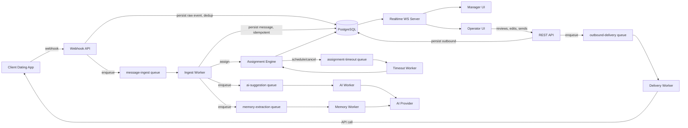

# GCO Architecture

## Overview



## Processes

- **web** - Next.js app: pages + `/api/v1/*` route handlers. Stateless, horizontally scalable.
- **worker** (`workers/index.ts`) - BullMQ consumers for all queues, plus a periodic sweep that retries assignment for stuck QUEUED/REASSIGNING conversations.
- **realtime** (`workers/realtime-server.ts`) - standalone WebSocket server, subscribes to Redis pub/sub per tenant channel, pushes to authenticated dashboard clients.

Each process can be scaled independently. Message processing, AI processing, and outbound delivery are separated into distinct queues (not distinct services) in V1 - see [decisions.md](decisions.md) for why we did not start with microservices.

## Critical-path guarantee

The webhook handler's only synchronous job is: verify signature -> validate -> persist raw `WebhookEvent` -> dedup -> enqueue -> return 2xx. All business logic (message persistence, assignment, AI) happens in the worker, off the request path. This means:

- A slow/broken AI provider never blocks message receipt.
- A crashed worker process loses zero events - they remain in the durable Redis-backed queue and BullMQ redelivers.
- Duplicate webhook deliveries are no-ops (unique constraint on `integrationId + externalEventId`).

## Message lifecycle trace

Every message can be traced end-to-end via `MessageEvent` rows and the linked ids:

```
webhook_event_id -> message_id -> conversation_id -> assignment_id -> ai_generation_id -> outbound message_id -> usage_record_id
```

See [operations.md](operations.md) for how to use this to answer "why wasn't this message answered".
